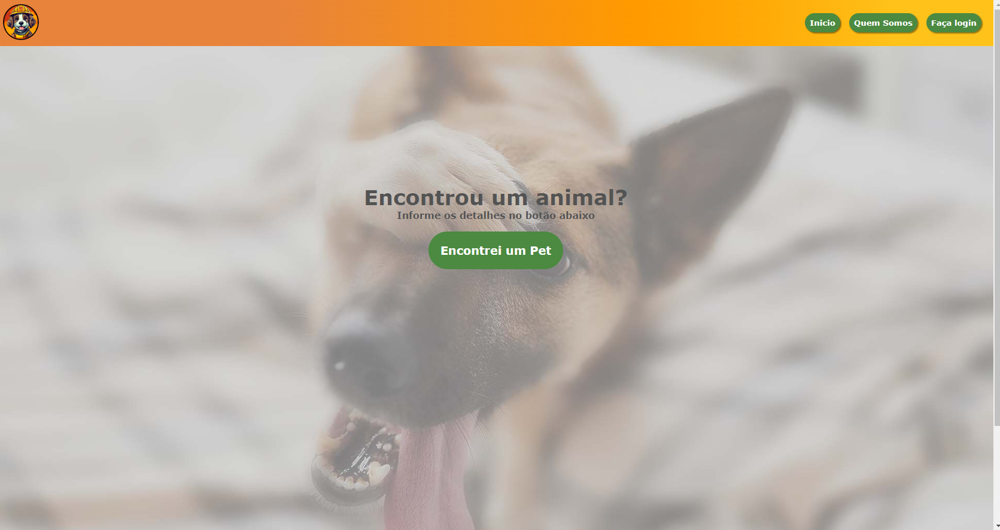
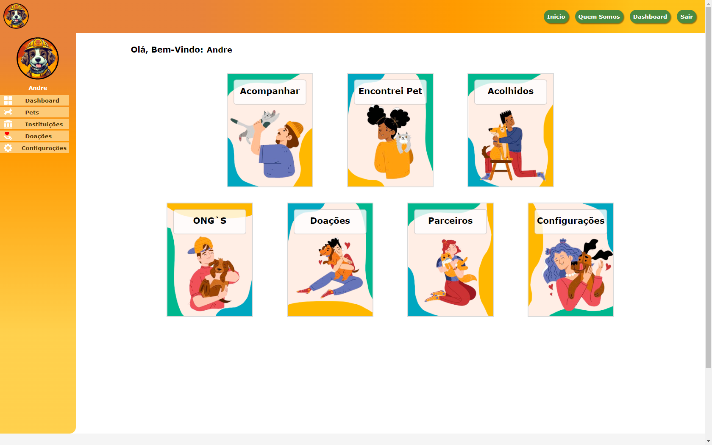
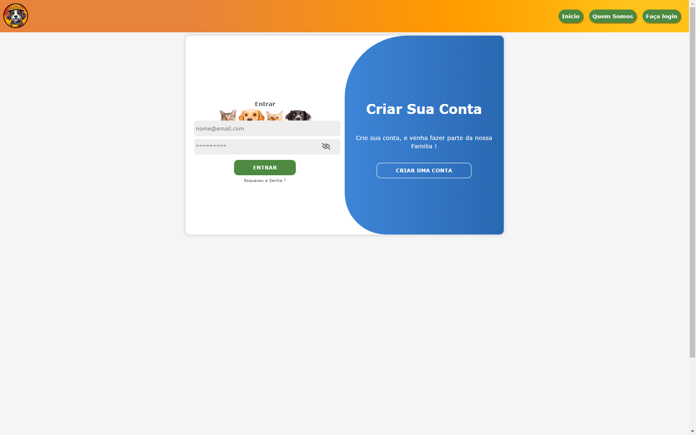

 

   

# Introdução
Esse projeto foi criado em aula no curso Full-Stack na escola Senac, o site foi desenvolvido partir de uma ideia desde o planejamento até o design, resolvendo problemas e corrigindo bugs.  
O Site tem como objetivo de resgatar os Pets abandonados e passar para as ONG 's responsáveis, com a companhamento do resgate do pet até o destino final, tem um feedback dos pets acolhidos, contando 
a sua historia e compartilhando a sua trajetoria, o site conta com um menu lateral, com as paginas dashboard, quem somos, login e cadastro, esqueceu senha, econtrei um pet, acompamento, parceiros,  
ongs, doações, configurações e erro 404. O Front-End foi desenvolvido em React, javascript, typescript, html e css, também utilizando o photoshop, figma e trello, para o banco de dados estamos utilizando 
o MySQL junto com uma [API].

## Características
Esse site tem como objetivo resgatar os Pets abandonados e passar para as ONG 's responsáveis. O site foi desenvolvido em um Projeto Integrador no Senac no curso Full-Stack.

- **Login**: via [API] comunicando com o banco MySQL
- **Cadastrar**: criação de conta de CPF/CNJP separados por id.
- **Dashboard**: mensagens de boas vindas com personalização de nome, atalhos de acesso rápido, dashboard pernalizado para cada usuario.
- **Acompanhar**: tabela com todos os pets cadastrados pelo usuario.
- **Configurações**: visualização do perfil dos usuarios com dados cadastrados. 

## Screenshot

    
    
    
     
    

## Acessar ao Site
O nosso site esta hospedado em [ResgatPet]
 
### 👾 Linguagens e Ferramentas

 

#
[ResgatPet]: https://resgatpet.pvferreira.com.br/
[API]: https://github.com/andrecomegno/ResgatPetAPI
